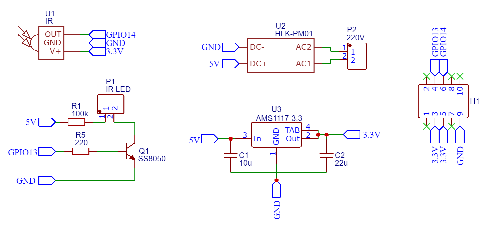

# ESPCore
Микроконтроллерное устройство, позволяющее взаимодействовать с различными типами устройств бытовой техники по наиболее распространенным протоколам, которое можно не только интегрировать в существующие системы, но и использовать самостоятельно.

В качестве программного обеспечения для устройства используются прошивки Tasmota и Sonoff. Имеется возможность создавать собственные прошивки с помощью Arduino Core.

## Управляющий модуль (ESPCore)
Основной модуль представляет собой управляющее устройство и состоит из микроконтроллера ESP8266 в виде модуля ESP-03, метеодатчика BME280 и минимальной необходимой обвязки для их функционирования.

### Схема модуля

### Печатная плата

### 3D Модель

## Плата расширения с реле (ESPCore Relay Module)
Плата расширения представляет собой исполнительный механизм с электромагнитным реле, управляемый основным модулем. С помощью платы организуется управление бытовой техникой, схема позволяет управлять простыми устройствами, поддерживающими только включение или выключение путем подачи на них напряжения питания.

На плате расположены AC/DC преобразователь, само реле и стабилизатор напряжения, а также минимально необходимая обвязка, которая необходима для функционирования схемы.

### Схема платы расширения

### Печатная плата

### 3D Модель

## Плата расширения с ИК управлением (ESPCore IR Module)
Плата расширения с инфракрасным управлением является исполнительным механизмом, который позволяет принимать и отправлять сигналы в ИК диапазоне. Предполагается использование для управления бытовой техникой, поддерживающей управление таким способом.

Используя плату вместе с управляющим устройством, имеется возможность организовать управление узлами системы с помощью ИК команд. В этом случае устройство будет являться мостом, принимая  команды сигналами ИК диапазона и перенаправляя их в другие устройства с помощью сетевых протоколов управления.

Таким образом, используя инфракрасный пульт, например, от телевизора, можно управлять другим устройством изменяя состояние реле или посылая команды в ИК диапазоне.

### Схема платы расширения

### Печатная плата

### 3D Модель

## Переходник для прошивки управляющего модуля (ESPCore Flasher)
Представляет собой переходник, подключаемый к USB-UART адаптеру, с помощью которого предлагается обновлять прошивку управляющего модуля. Позволяет без дополнительных проводов или макетных плат загрузить прошивку в память микроконтроллера, установленного на управляющем модуле.

### Схема платы расширения

### Печатная плата

### 3D Модель

